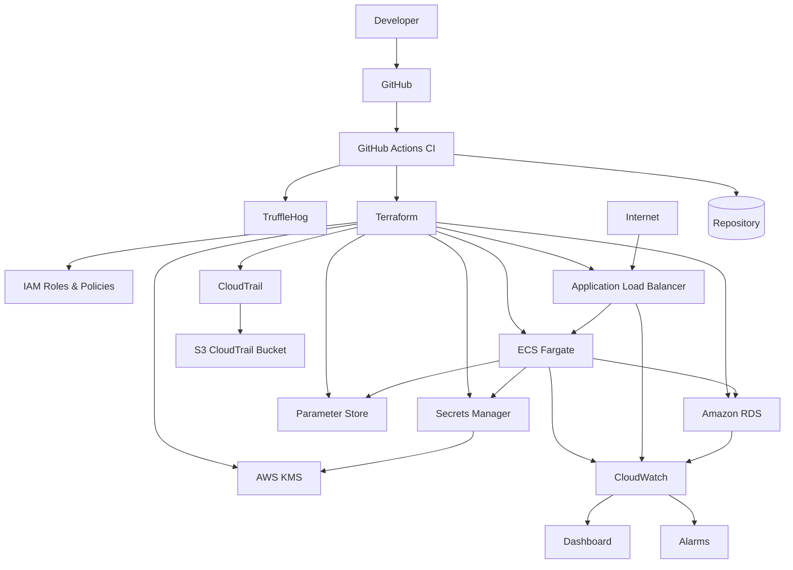
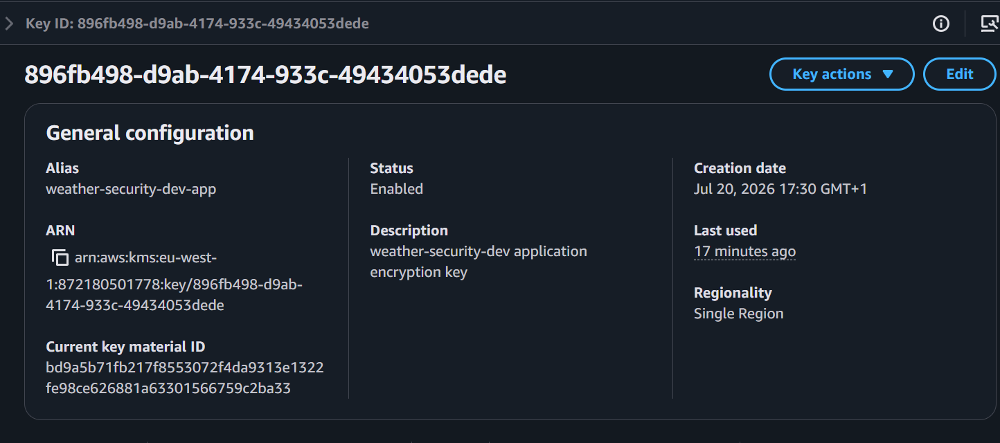
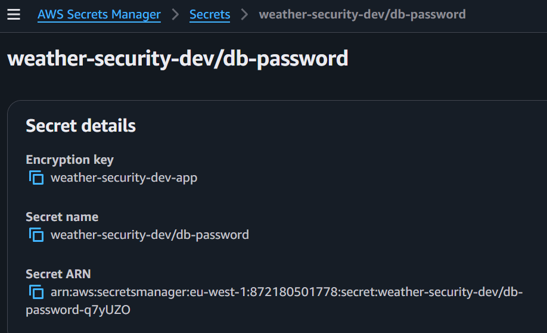
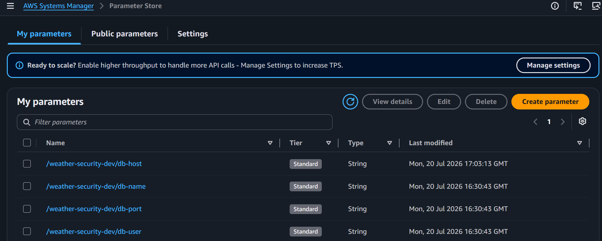
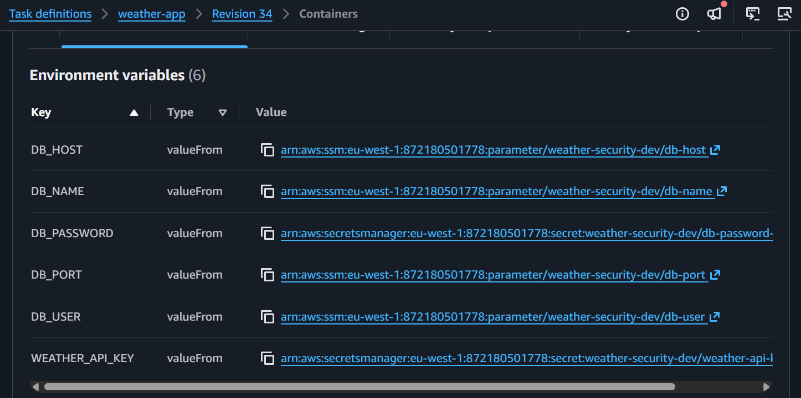
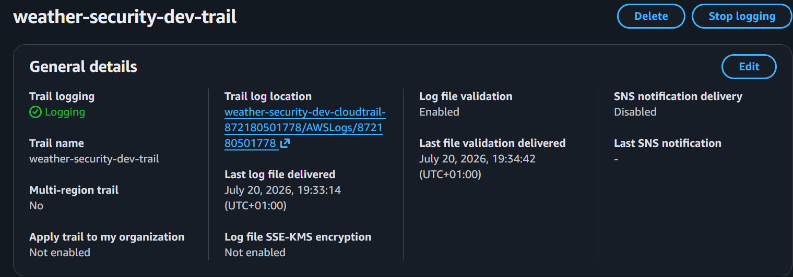
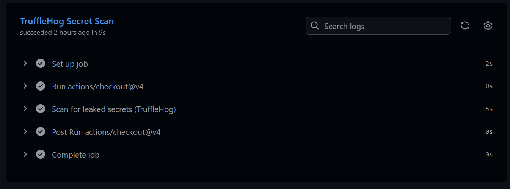
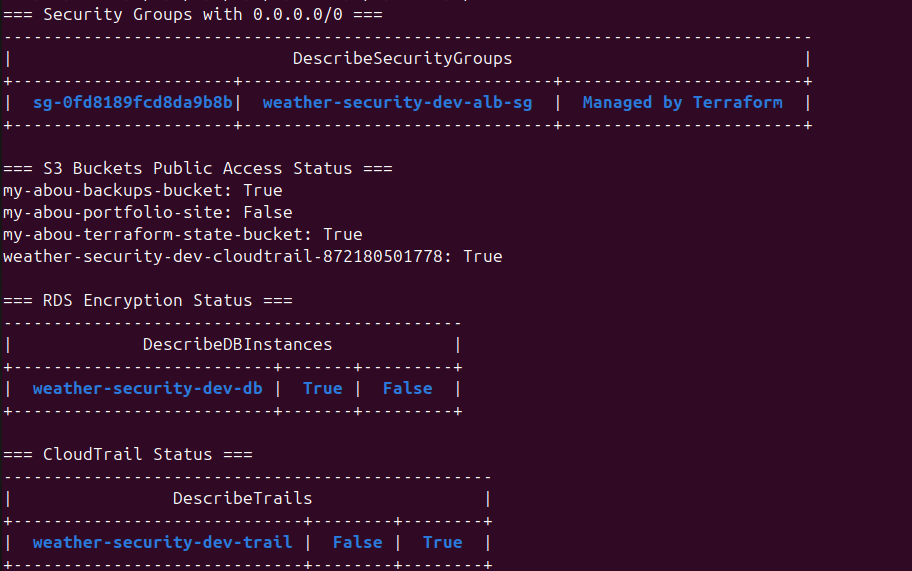

# 🔐 ECS Weather Platform – Security Hardening


---

# 📖 Project Overview

This project is the security-focused continuation of the **ECS Weather Platform with Monitoring**. Rather than building a new application, the goal was to **harden an existing production-style AWS infrastructure** using cloud security best practices while ensuring the application remained fully operational.

The infrastructure is entirely provisioned using **Terraform**, and the project focuses on protecting infrastructure, credentials, secrets, and application configuration without changing the application's functionality.

Throughout this project, several production-grade AWS security services and practices were introduced, including:

- Customer Managed KMS Keys
- IAM least-privilege policies
- AWS Secrets Manager encryption
- AWS Systems Manager Parameter Store
- CloudTrail auditing
- Infrastructure security hardening
- Secret scanning with TruffleHog
- Automated security auditing
- Continuous verification after every security improvement

A major objective was demonstrating that security improvements can be implemented **without affecting application availability**. After all hardening changes, the ECS application continued serving traffic successfully and maintained database connectivity.

---

# 🎯 Project Objectives

The primary goals of this project were to:

- Audit IAM users and credentials
- Apply the Principle of Least Privilege
- Encrypt Secrets Manager secrets using a Customer Managed KMS Key
- Move non-sensitive configuration into Systems Manager Parameter Store
- Reduce hardcoded configuration inside ECS Task Definitions
- Enable CloudTrail for account auditing
- Harden infrastructure against common security risks
- Integrate TruffleHog into the CI pipeline
- Build an automated AWS security audit script
- Verify the application continued operating after every security enhancement

---

# ✨ Key Features

## 🔑 Identity & Access Management

- IAM credential auditing
- Access key hygiene verification
- Least-privilege IAM policies
- Dedicated ECS Execution Role
- Dedicated ECS Task Role
- Fine-grained Secrets Manager permissions
- Fine-grained Parameter Store permissions

---

## 🔒 Data Protection

- Customer Managed AWS KMS Key
- Secrets encrypted using CMK
- Encrypted Amazon RDS database
- Encrypted S3 buckets
- Secure Terraform remote state bucket
- HTTPS-only bucket policy

---

## 🔐 Secrets Management

Sensitive values stored in **AWS Secrets Manager**

- Database password
- Weather API key

Non-sensitive configuration stored in **AWS Systems Manager Parameter Store**

- Database host
- Database name
- Database port
- Database username

No application configuration remains hardcoded inside the ECS Task Definition.

---

## 📋 Security Monitoring

- CloudTrail enabled
- Log file validation enabled
- CloudTrail log storage in S3
- CloudWatch monitoring preserved
- Existing alarms verified after hardening

---

## 🚀 DevSecOps

GitHub Actions pipeline enhanced with:

- Python testing
- Terraform validation
- Linting
- Security scanning
- Docker build verification
- TruffleHog secret scanning

---

# 🏗️ High-Level Architecture



---

# 📂 Repository Structure

```text
ecs-weather-platform-secured/

├── .github/
│   └── workflows/
│       └── ci.yml
│
├── app/
│
├── terraform/
│   ├── modules/
│   │   ├── alb/
│   │   ├── ecr/
│   │   ├── ecs/
│   │   ├── iam/
│   │   ├── monitoring/
│   │   ├── rds/
│   │   ├── security/
│   │   ├── security_groups/
│   │   └── vpc/
│   │
│   ├── backend.hcl
│   ├── main.tf
│   ├── variables.tf
│   ├── outputs.tf
│   └── iam.tf
│
├── scripts/
│   └── security-audit.sh
│
├── docker-compose.yml
├── Dockerfile
├── requirements.txt
└── README.md
```

---

# 🛡️ Security Architecture

Instead of storing credentials or configuration directly inside the application, the infrastructure now follows a layered security model.

```text
                    AWS KMS (Customer Managed Key)
                               │
                               ▼
                    AWS Secrets Manager
                    ┌───────────────────┐
                    │ DB_PASSWORD       │
                    │ WEATHER_API_KEY   │
                    └───────────────────┘
                               ▲
                               │
                 ECS Execution Role (Least Privilege)
                               │
                               ▼
                    ECS Task Definition
               (No Hardcoded Configuration)
                               ▲
                               │
                  AWS Systems Manager
                    Parameter Store
        ┌─────────────────────────────────┐
        │ DB_HOST                         │
        │ DB_NAME                         │
        │ DB_PORT                         │
        │ DB_USER                         │
        └─────────────────────────────────┘
```

---

# 🔐 Security Improvements

Unlike previous iterations of the Weather Platform, this version focuses on securing the infrastructure while keeping the application fully operational.

Every change follows AWS security best practices and production recommendations.

---

# 🔑 Identity & Access Management (IAM)

The first stage of the project was reviewing how the application interacted with AWS services.

The infrastructure follows the **Principle of Least Privilege**, meaning every IAM role receives only the permissions required for its specific responsibility.

Two dedicated ECS roles are used.

## ECS Execution Role

The Execution Role is assumed by the ECS agent.

Responsibilities:

- Pull Docker images from Amazon ECR
- Read secrets from AWS Secrets Manager
- Read configuration from AWS Systems Manager Parameter Store
- Send application logs to CloudWatch Logs

Permissions include:

- AmazonECSTaskExecutionRolePolicy
- Secrets Manager access
- Parameter Store access

---

## ECS Task Role

The Task Role is assumed by the application running inside the container.

Responsibilities:

- Publish custom CloudWatch metrics
- Execute ECS Exec sessions through AWS Systems Manager
- Access only the AWS services required by the application

This separation prevents the application from receiving unnecessary infrastructure permissions.

---

# 🔐 AWS KMS

A Customer Managed Key (CMK) was introduced to replace the default AWS-managed encryption for application secrets.

The KMS key is used to encrypt:

- Database password
- Weather API key

Benefits:

- Customer-controlled encryption
- Key rotation support
- Fine-grained IAM control
- CloudTrail audit logging for key usage

Terraform automatically associates the Customer Managed Key with every Secrets Manager secret.



---

# 🔒 AWS Secrets Manager

Sensitive application values are stored in AWS Secrets Manager instead of Terraform variables or ECS environment variables.

Stored secrets:

- Database password
- OpenWeather API key

The ECS Execution Role retrieves these values securely during task startup.

No secret values are exposed inside:

- Terraform state variables
- Task Definition environment variables
- Application source code



---

# ⚙️ AWS Systems Manager Parameter Store

Configuration values that are **not sensitive** were moved into Systems Manager Parameter Store.

Stored parameters include:

- Database host
- Database name
- Database port
- Database username

The ECS Task Definition now retrieves these parameters dynamically at runtime.

This completely removes hardcoded infrastructure configuration from the container definition.



---

# 📋 ECS Task Definition Hardening

Before this project, several configuration values were defined as environment variables.

After the security improvements:

- Sensitive values come from Secrets Manager.
- Non-sensitive values come from Parameter Store.

As a result:

- No credentials are stored inside the Task Definition.
- Infrastructure changes require fewer code modifications.
- Configuration can be updated without rebuilding the application image.



---

# 🛡️ Infrastructure Hardening

Additional hardening was applied across AWS resources.

## Amazon S3

Implemented:

- Server-side encryption (AES-256)
- Block Public Access
- HTTPS-only bucket policy
- Protected Terraform remote state bucket

---

## Amazon RDS

The database now includes:

- Storage encryption enabled
- Private subnet deployment
- No public accessibility

Database functionality remained unchanged after encryption.

---

## AWS CloudTrail

CloudTrail was enabled to record management events across the AWS account.

Configuration includes:

- Multi-AZ log delivery
- Log file validation
- Dedicated encrypted S3 bucket

CloudTrail provides an audit trail for infrastructure changes and security investigations.



---

# 🚀 CI/CD Security

The GitHub Actions pipeline was extended with additional security validation.

Pipeline stages include:

- Terraform validation
- Python testing
- Docker build verification
- Static analysis
- Secret scanning

---

## TruffleHog

TruffleHog was integrated into the CI pipeline to detect accidentally committed secrets.

The scanner runs automatically on every push before Docker image verification.

Using:

```
--only-verified
```

reduces false positives by reporting only secrets that can be validated.

This ensures leaked credentials are detected before deployment.



---

# 📊 Automated Security Audit

A reusable Bash audit script was created to verify the infrastructure security posture.

The script automatically checks:

- IAM credential report
- Security Groups exposing 0.0.0.0/0
- S3 Public Access configuration
- Bucket encryption
- RDS encryption
- CloudTrail status

The audit was executed before and after the hardening process to demonstrate measurable security improvements.

## Audit Results

The initial audit highlighted areas requiring improvement, including missing encryption, incomplete bucket protection, and the absence of centralized audit logging.

After completing the project, the audit confirmed:

- ✓ RDS storage encryption enabled
- ✓ CloudTrail logging enabled
- ✓ S3 bucket encryption configured
- ✓ Public Access Block enabled on secured buckets
- ✓ Customer Managed KMS Key protecting Secrets Manager
- ✓ ECS Task Definition using Secrets Manager and Parameter Store



---

# ✅ Security Verification

After deployment, every major security control was verified through the AWS CLI.

Verification included:

- Customer Managed KMS Key protecting Secrets Manager
- Parameter Store configuration retrieval
- RDS storage encryption
- CloudTrail logging enabled
- S3 bucket encryption
- Public Access Block configuration
- ECS Task Definition using Secrets Manager and Parameter Store
- Application health endpoint remaining operational

The infrastructure remained fully functional while adopting significantly stronger security controls.

# ⚙️ Engineering Journey

This project was not simply about enabling AWS security features. It required integrating security controls into an already functional cloud application without breaking deployments, application availability, or the CI/CD pipeline.

Several production-style challenges were encountered throughout the implementation, requiring investigation, troubleshooting, and iterative improvements.

---

# 🧩 Challenges & Solutions

## Challenge 1 — Applying Least Privilege

### Problem

The original ECS infrastructure already contained IAM roles from previous projects. Determining which permissions belonged to the Execution Role versus the Task Role required reviewing existing policies and understanding how ECS interacts with AWS services.

### Solution

Separated responsibilities into dedicated IAM roles.

Execution Role:

- Pull images from ECR
- Read Secrets Manager
- Read Parameter Store
- Write CloudWatch Logs

Task Role:

- ECS Exec
- Custom CloudWatch metrics

This produced a much cleaner security model while following AWS least-privilege recommendations.

---

## Challenge 2 — Secrets vs Parameter Store

### Problem

Initially, several database configuration values were hardcoded inside the ECS Task Definition as environment variables.

Although functional, this approach was not ideal for production environments.

### Solution

Separated configuration into two categories.

Sensitive values:

- Database password
- Weather API key

Stored inside AWS Secrets Manager.

Non-sensitive values:

- Database host
- Database name
- Database port
- Database username

Stored inside Systems Manager Parameter Store.

The ECS Task Definition now retrieves every value dynamically.

---

## Challenge 3 — Terraform Module Dependencies

### Problem

Some security resources required information generated by other modules.

Terraform modules cannot directly reference each other.

### Solution

Outputs were exposed from one module and passed into another through the root module.

This preserved module independence while keeping the infrastructure modular and reusable.

---

## Challenge 4 — GitHub Actions Secret Scanning

### Problem

After adding TruffleHog to the CI pipeline, the first workflow failed because the base and head commits were identical.

### Solution

Configured TruffleHog appropriately for the repository workflow and positioned the scan before Docker image verification so secret scanning becomes part of the deployment gate.

---

## Challenge 5 — GitHub Actions Service Outage

### Problem

Every CI job remained queued indefinitely despite a valid workflow configuration.

### Solution

After verifying repository settings, workflow syntax, and runner configuration, the issue was traced to an active GitHub Actions service outage.

The pipeline resumed normally once GitHub restored hosted runners.

---

## Challenge 6 — GuardDuty Availability

### Problem

Terraform failed while creating the GuardDuty detector with a SubscriptionRequiredException.

### Solution

Investigation revealed the AWS Free Plan currently restricts GuardDuty activation.

The module was updated to support conditional deployment, allowing the infrastructure to deploy successfully while keeping GuardDuty ready for future activation.

---

## Challenge 7 — Free Plan RDS Restrictions

### Problem

Terraform failed when creating the RDS instance because the configured backup retention period exceeded the Free Plan limits.

### Solution

Adjusted the backup retention configuration to remain compatible with the account limitations while preserving storage encryption and database security.

---

## Challenge 8 — Security Verification

### Problem

Security controls are only valuable if they can be verified after deployment.

### Solution

Validated every implemented control using the AWS CLI, including:

- KMS encryption
- Secrets Manager
- Parameter Store
- CloudTrail
- S3 encryption
- RDS encryption
- ECS Task Definition
- Application health endpoint

This confirmed that the infrastructure remained fully functional after hardening.

---

# 📚 Lessons Learned

This project reinforced several important cloud security principles.

- Security should be integrated into infrastructure from the beginning rather than added later.
- Least Privilege dramatically reduces unnecessary permissions.
- Customer Managed KMS Keys provide significantly greater control than AWS-managed encryption.
- Secrets Manager and Parameter Store solve different problems and should be used together.
- CloudTrail is essential for auditing infrastructure changes.
- CI/CD pipelines should include automated secret scanning.
- Security improvements must always be validated after deployment.
- Modular Terraform design makes security enhancements easier to maintain.

---

# 🚀 Future Improvements

Potential enhancements include:

- Enable GuardDuty once account restrictions are removed.
- Add AWS Config compliance rules.
- Enable Amazon Inspector for container vulnerability scanning.
- Add IAM Access Analyzer.
- Enable Security Hub.
- Encrypt EBS volumes using Customer Managed KMS Keys.
- Implement AWS Organizations Service Control Policies (SCPs).
- Introduce automated compliance reporting.

---

# 🧹 Cleanup

Destroy all Terraform-managed resources when no longer required.

```bash
cd terraform

terraform destroy
```

> **Note**
>
> Amazon RDS instances with `deletion_protection = true` cannot be destroyed by Terraform.
>
> Before running `terraform destroy`, temporarily update the RDS configuration:
>
> ```hcl
> deletion_protection = false
> ```
>
> Apply the change:
>
> ```bash
> terraform apply
> ```
>
> Once the update completes, run:
>
> ```bash
> terraform destroy
> ```

Verify that no billable resources remain running inside the AWS account.

---

# ✅ Project Outcome

By the end of this project, the Weather Platform successfully transitioned from a functional cloud application to a significantly more secure production-inspired deployment.

Key improvements included:

- Customer Managed KMS encryption
- Secure secret management with AWS Secrets Manager
- Non-sensitive configuration stored in Parameter Store
- Principle of Least Privilege IAM policies
- CloudTrail auditing
- Hardened S3 buckets
- Encrypted RDS database
- Automated secret scanning in CI/CD
- Automated infrastructure security auditing

Most importantly, all security enhancements were implemented without impacting application availability or deployment automation.

---

# 📄 License

This project is licensed under the MIT License.

---

# 🙏 Acknowledgements

This project is part of my Cloud Engineering learning journey, focusing on applying production-inspired AWS security practices using Terraform, ECS Fargate, GitHub Actions, and modern DevSecOps principles.

The objective was not only to secure the infrastructure but also to understand the reasoning behind every security control and verify its effectiveness through real AWS deployments.

---

# 👨‍💻 Author

**Aboubakr**

Cloud Engineer

GitHub: https://github.com/Aboubakr2000Cloud
